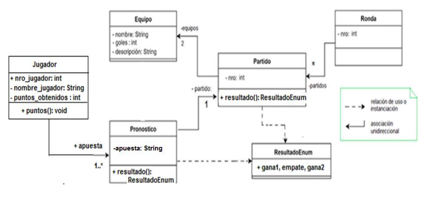

# TP Integrador - “Desarrollador Java Inicial”
##  Integrador Argentina Programa
(WIP) Repo del trabajo integrador del curso Java inicial de Argentina Programa

### Introducción
  Nos han solicitado el desarrollo de un programa de **Pronósticos Deportivos**. Un pronóstico deportivo consta de un posible resultado de un partido (que un equipo gane, pierda o empate), propuesto por una persona que está participando de una competencia contra otras. Cada partido tendrá un resultado. Este resultado se utilizará para otorgar puntos a los participantes de la competencia según el acierto de sus pronósticos. Finalmente, quien gane la competencia será aquella persona que sume mayor cantidad de puntos. 

  ### Consigna
   La propuesta del trabajo práctico consiste en implementar un programa de consola que dada la información de resultados de partidos e información de pronósticos, ordene por puntaje obtenido a los participantes. 

   ### Alcance 
   En este trabajo práctico nos limitaremos a pronosticar los resultados de los partidos, sin importar los goles ni la estructura del torneo (si es grupo, eliminatoria u otro); simplemente se sumarán puntos y se obtendrá un listado final.

   ### Diagrama inicial de clases
   

# Integrantes

**Grupo 20** Comisión 62

## Tecnologías utilizadas

Proyecto basado en Java con Maven
<!-- TODO completar instrucciones
## Instrucciones de uso -->

